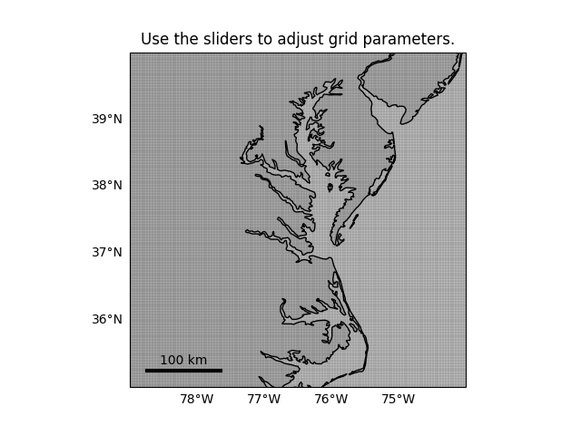
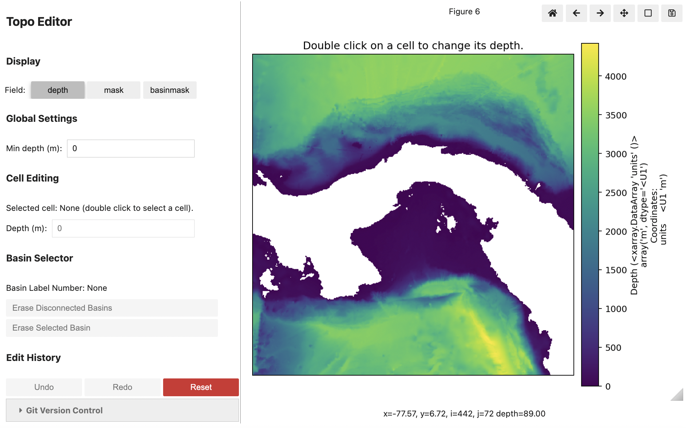
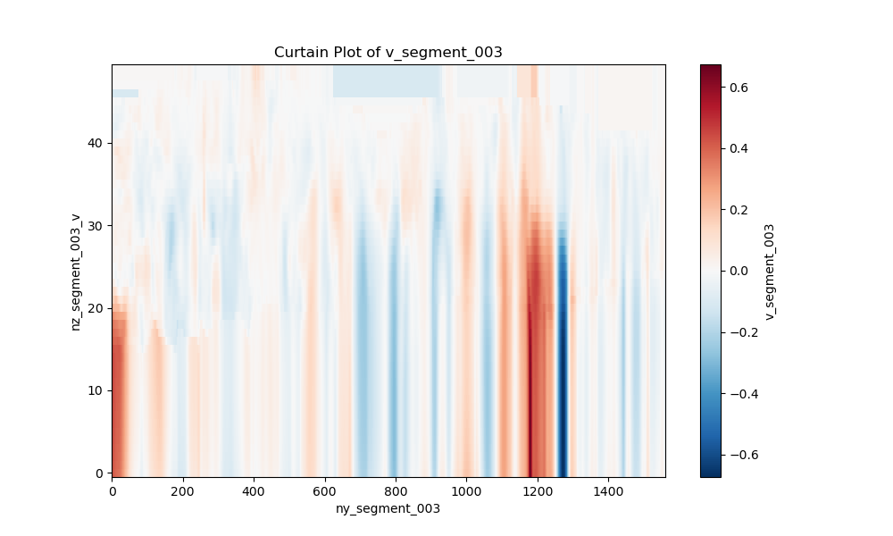
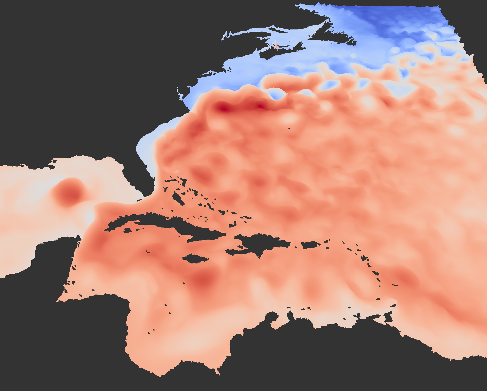

  
CROCODILE Ecosystem

  <h1 class="cd-hero__title">CrocoDash</h1>
  

    The Python package for configuring, customizing, and setting up regional MOM6 ocean models in CESM.
    From grid generation to boundary conditions, all in one place.
  

  

    <a class="cd-btn cd-btn--primary" href="tutorial.ipynb">Get Started →</a>
    <a class="cd-btn cd-btn--outline" href="https://github.com/CROCODILE-CESM/CrocoDash">GitHub ↗</a>
  

## What It Produces

  

    
    
Regional Grid Generation

  

  

    
    
Git-Logged Bathymetry Editing

  

  

    
    
Boundary Condition Generation

  

  

    
    
Model Ready Inputs

  

## Explore the Content

  <a class="cd-nav-card" href="tutorial.ipynb">
    <h3>Tutorial</h3>
    
End-to-end walkthrough from installation to a running regional model.

  </a>
  <a class="cd-nav-card" href="configure_forcings.ipynb">
    <h3>Step-by-Step Notebooks</h3>
    
Deep dives into each workflow step: grids, bathymetry, case setup, forcings, and coupling (BGC, CICE).

  </a>
  <a class="cd-nav-card" href="use_cases/three_boundary.ipynb">
    <h3>Use Cases</h3>
    
Real-world configurations and advanced setups for specific ocean regions.

  </a>
  <a class="cd-nav-card" href="projects/index.md">
    <h3>Projects</h3>
    
Open-ended, self-directed briefs for the workshop: your region, your configuration, your result.

  </a>

