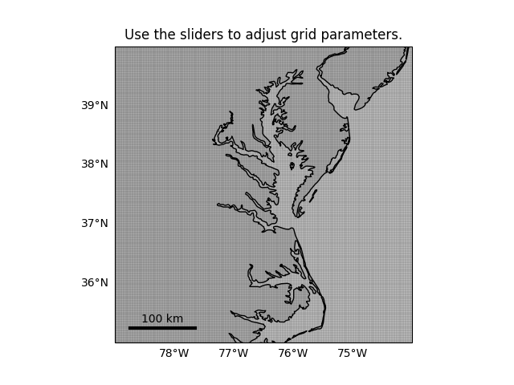
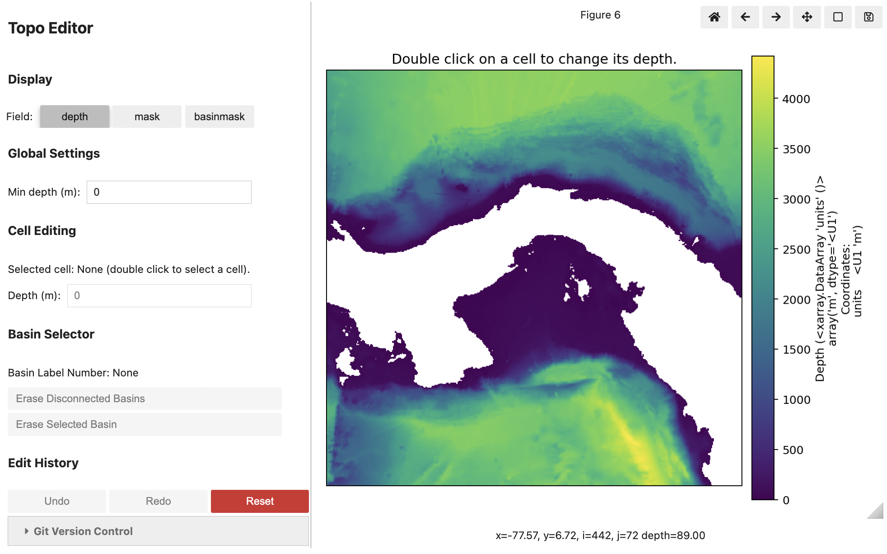
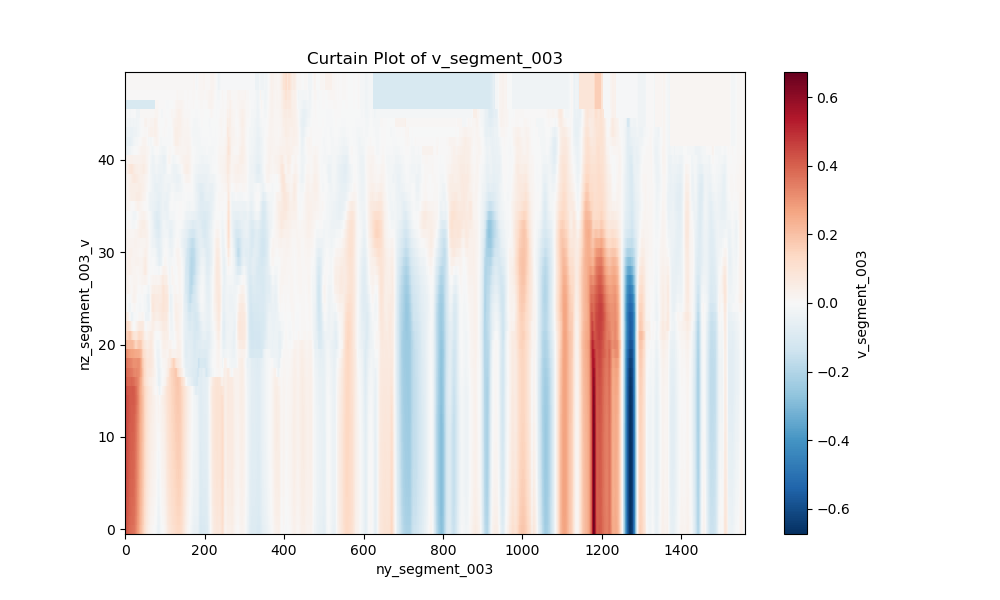
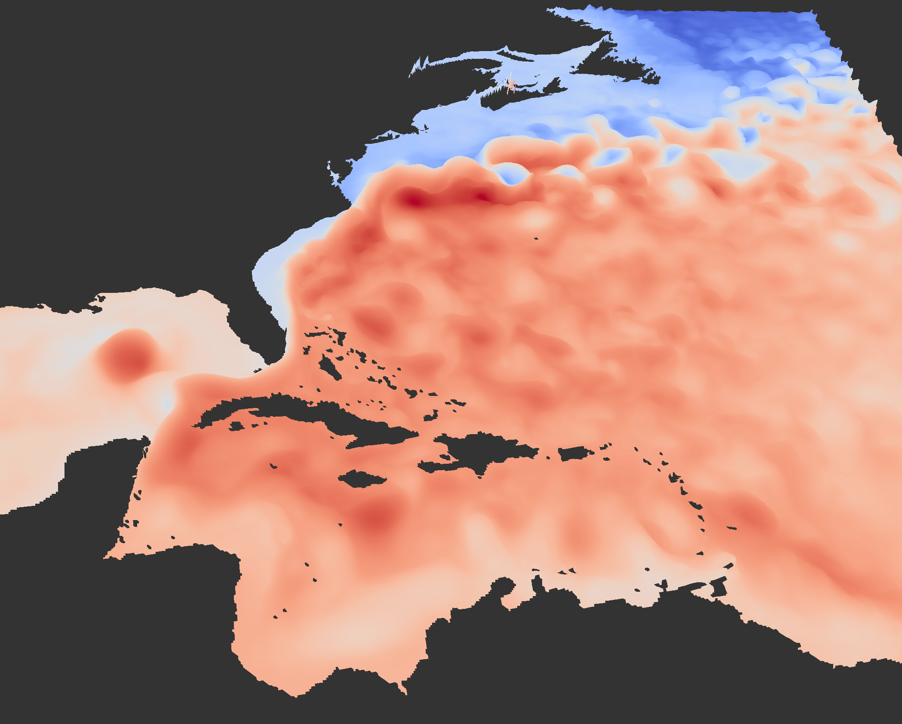

  <strong>🚧 This page is under active development.</strong>
  Some features shown here may not be reproducible with the latest tagged release of CrocoDash,
  but can be found on branches in the
  <a href="https://github.com/CROCODILE-CESM/CrocoDash">CrocoDash GitHub repository ↗</a>.

  
CROCODILE Ecosystem

  <h1 class="cd-hero__title">CrocoDash</h1>
  

    The Python toolkit for configuring, customizing, and setting up regional MOM6 ocean models in CESM.
    From grid generation to boundary conditions — all in one place.
  

  

    <a class="cd-btn cd-btn--primary" href="notebooks/CrocoDash/tutorials/crocodash_tutorial">Get Started →</a>
    <a class="cd-btn cd-btn--outline" href="https://github.com/CROCODILE-CESM/CrocoDash">GitHub ↗</a>
  

## What It Produces

  

    
    
Regional Grid Generation

  

  

    
    
Git-Logged Bathymetry Editing

  

  

    
    
Boundary Condition Generation

  

  

    
    
Model Output

  

## What CrocoDash Can Do (Beyond General Setup)

  

    
🔗

    <h3>Coupling</h3>
    
Add BGC and CICE coupled components to your regional ocean configuration.

  

  

    
🗺️

    <h3>Grid Customization</h3>
    
Subset global grids or build custom regional grids for any ocean domain.

  

  

    
📦

    <h3>Data Products</h3>
    
Manage boundary conditions, initial conditions, and forcing data from a variety of data sources.

  

  

    
🌊

    <h3>Additional Physics</h3>
    
Add tides, runoff, chlorophyll, and other components with a single function call.

  

## Notebook Status

Live CI status for every notebook — badges update automatically after each nightly run.

| Notebook | Status |
|---|---|
| [CrocoDash Tutorial](notebooks/CrocoDash/tutorials/crocodash_tutorial) |  |
| [Add Grids](notebooks/CrocoDash/features/grids/add_grids) |  |
| [Subset Global Grid](notebooks/CrocoDash/features/grids/subset_global) |  |
| [Add CICE](notebooks/CrocoDash/features/coupling/add_cice) |  |
| [Add Data Products](notebooks/CrocoDash/features/data_handling/add_data_products) |  |
| [Too Much Data](notebooks/CrocoDash/features/data_handling/too_much_data) |  |
| [Add Chlorophyll](notebooks/CrocoDash/features/add_chl) |  |
| [Add Runoff](notebooks/CrocoDash/features/add_rof) |  |
| [Add Runoff Product](notebooks/CrocoDash/features/add_runoff_product) |  |
| [Add Tides](notebooks/CrocoDash/features/add_tides) |  |
| [MOM6 + CICE Antarctica](notebooks/CrocoDash/use_cases/mom6_cice_antarctica) |  |
| [Three Boundary from T232](notebooks/CrocoDash/use_cases/three_boundary_from_t232) |  |
| [CrocoDash Projects](notebooks/CrocoDash/projects/CrocoDash) |  |
| [CICE Antarctica Project](notebooks/CrocoDash/projects/sample_crocodash_projects/CICE_antarctica) |  |
| [CICE Arctic Project](notebooks/CrocoDash/projects/sample_crocodash_projects/CICE_arctic) |  |
| [DROF Project](notebooks/CrocoDash/projects/sample_crocodash_projects/DROF) |  |
| [NWA Project](notebooks/CrocoDash/projects/sample_crocodash_projects/NWA) |  |

## Explore the Content

  <a class="cd-nav-card" href="notebooks/CrocoDash/tutorials/crocodash_tutorial">
    <h3>Tutorial</h3>
    
End-to-end walkthrough from installation to a running regional model.

  </a>
  <a class="cd-nav-card" href="notebooks/CrocoDash/features/coupling/add_bgc">
    <h3>Feature Notebooks</h3>
    
Deep dives into specific CrocoDash capabilities — BGC, CICE, tides, runoff, and more.

  </a>
  <a class="cd-nav-card" href="notebooks/CrocoDash/use_cases/three_boundary">
    <h3>Use Cases</h3>
    
Real-world configurations and advanced setups for specific ocean regions.

  </a>

