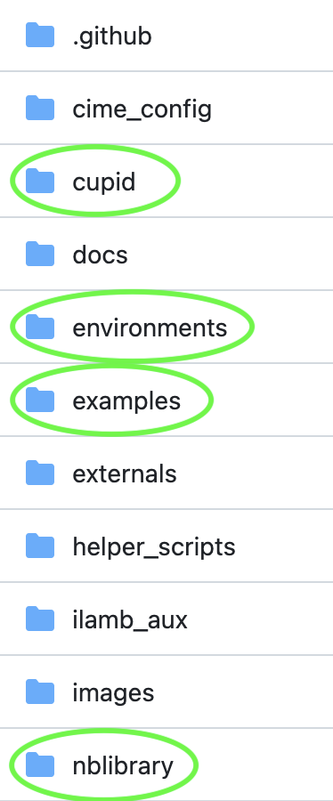
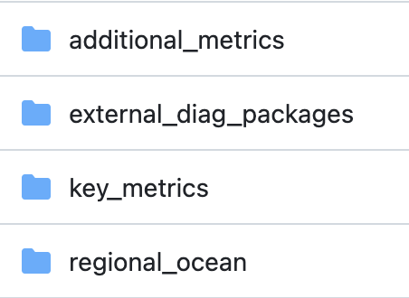
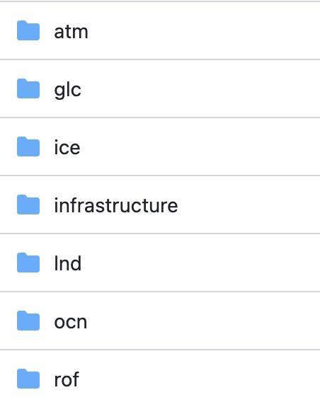
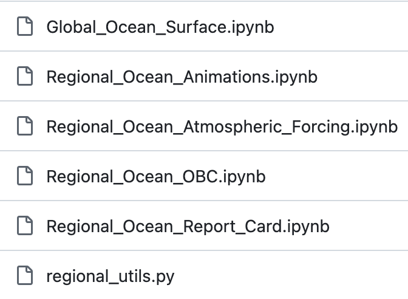

# Installing CUPiD

This page follows the [CUPiD Installation Documentation](https://ncar.github.io/CUPiD/#installing),
with some tweaks specific to the NCAR super computer.

<div class="alert" role="alert" style="background-color:rgb(255,126,185); color: #5C0029; border-color:rgb(255,126,185);">
<h4 style="margin-top: 0; padding-top: 0; display: inline-flex; color:rgb(31, 0, 14);"> <strong> Checkpoint #1 </strong> </h4>

At this point you should have a running JupyterHub instance.
</div>

## Task 0: Open a Terminal in JupyterHub for this Activity

### 0.1 Navigate to your `crocodile_2025` directory
We all have a directory that we have been using all week for the practical exercises.
The full path to this should be: `/glade/work/${USER}/crocodile_2025`.
To access this directory:

1. Click **File** in the top left and select **Open from Path...**
2. In the pop-up field enter: `/work/${USER}/crocodile_2025`

Note that JupyterHub references the filesystem relative to `/glade`,
so we don't need include that part of the path in step 2 above.


### 0.2 Open a terminal
Open a Terminal instance by scrolling all the way down in the launcher tab and selecting **Terminal**.

This will open a terminal with the following prompt:
`USERNAME@crhtcXX:/glade/work/USERNAME/crocodile_2025>`

## Task 1: Clone CUPiD and Install Environments

CUPiD is available from the NCAR organization on [github.com](https://github.com/NCAR/CUPiD).
It requires conda to manage a few different python environments.
The NCAR system administrators provide conda through a module,
which you can access by running

```bash
module load conda
```

### 1.1: Clone the repository from github

Running the following command will create a subdirectory named `CUPiD` in your current working directory:

```bash
git clone --recurse-submodules https://github.com/NCAR/CUPiD.git
```

<div class="alert" role="alert" style="background-color:rgb(255,126,185); color: #5C0029; border-color:rgb(255,126,185);">
<h4 style="margin-top: 0; padding-top: 0; display: inline-flex; color:rgb(31, 0, 14);"> <strong> Checkpoint #2 </strong> </h4>

At this point you should have an open terminal in JupyterHub,
the current working directory should be your `crocodile_2025` workshop directory,
and you should have successfully cloned the CUPiD repository.
</div>

The rest of this tutorial will refer to the location you installed CUPiD as `${CUPID_ROOT}`.
To be able to copy and paste blocks of commands directly, we need to add the variable to your environment.

Most of you are using `bash` or `zsh`,
which have been the default shell on Linux and Unix computers for a while now.
To set the environment variable run

```bash
cd CUPiD
export CUPID_ROOT=`pwd -P`
```

**Note:** This environment variable only exists in this specific terminal.
It will need to exported again if you open a separate terminal,
unless you modify your start files
(see the [NCAR documentation for this process](https://ncar-hpc-docs.readthedocs.io/en/latest/environment-and-software/user-environment/customizing/) for more information).

<div class="alert alert-warning">
<details>

<summary>Using a different shell?</summary><br>

If you have changed your shell to `csh` or `tcsh`,
you will want to run the following instead:

```bash
cd CUPiD
setenv CUPID_ROOT `pwd -P`
```

If you do not know for a fact that you changed your shell,
you can probably assume you are using `bash`.
To know for sure, though, run

```bash
echo $SHELL
```

</div>

### 1.2: Install two conda environments

CUPiD needs a python environment with specific packages installed to run the CUPiD tools,
while the diagnostic notebooks provided with CUPiD need a different set of packages.

To run CUPiD itself we use the `(cupid-infrastructure)` environment, then CUPiD runs the diagnostics notebooks with `(cupid-analysis)`.
We will use `mamba` to install these environments and the `--yes` option to avoid `mamba` waiting for approval before continuing with the install:

#### Install `(cupid-infrastructure)` and `(cupid-analysis)`

```bash
cd ${CUPID_ROOT}
mamba env create -f environments/cupid-infrastructure.yml --yes && \
mamba env create -f environments/cupid-analysis.yml --yes
```

**Notes:**

1. This is two separate commands separated by `&&`;
the second command (installing `(cupid-analysis)`) will only run if the first command (installing `(cupid-infrastructure)` finishes successfully).
Also, the `\` is a line continuation operator -
without it, the command would be on a single line and very long.
1. If you remove the `--yes` flag, `mamba` will ask you to confirm the installation after it determines what packages will be installed.


## Basic Walkthrough of CUPiD (`cupid-diagnostics` script and directory structure)

While the CUPiD environments install, let's talk about how CUPiD works.
CUPiD can provide diagnostics for a single run,
or compare a single run to a single baseline run.
Future development will enable comparison of more than two different runs,
but the next exercise in this tutorial will be using CUPiD to create diagnostics for a single CESM case that has already been run.
This will be done by running the `cupid-diagnostics` command from the `(cupid-infrastructure)` environment.

```
(cupid-infrastructure) $ cupid-diagnostics --help
Usage: cupid-diagnostics [OPTIONS] [CONFIG_PATH]

  Main engine to set up running all the notebooks.

  Args:     CONFIG_PATH: str, path to configuration file (default config.yml)

  Returns:     None

  Called by ``cupid-diagnostics``.

Options:
  -s, --serial          Do not use LocalCluster objects
  -atm, --atmosphere    Run atmosphere component diagnostics
  -ocn, --ocean         Run ocean component diagnostics
  -lnd, --land          Run land component diagnostics
  -ice, --seaice        Run sea ice component diagnostics
  -glc, --landice       Run land ice component diagnostics
  -rof, --river-runoff  Run river runoff component diagnostics
  -h, --help            Show this message and exit.
```

Notice that `cupid-diagnostics` has a few options to allow you to run a subset of the default diagnostics,
but the `CONFIG_PATH` argument (which defaults to `config.yml`) is the important argument.
CUPiD provides a set of examples (found in the `examples/` directory),
each with its own `config.yml` file.

The [Configuration File](https://ncar.github.io/CUPiD/config.html) page of the CUPiD website goes into more detail looking at the `key_metrics` example,
but in the [Running a CUPiD Example](standalone_CUPiD) we will look at the [`config.yml`](https://github.com/AidanJanney/CUPiD/blob/CROCODILE_Workshop_2025/examples/regional_ocean/config.yml) file associated with the `regional_ocean` example.

### Directory Structure of CUPiD

Before we dive into the details of how CUPiD works,
let's take a broader view of the CUPiD directory structure.
As you can see in the [CUPiD github repository](https://github.com/NCAR/CUPiD),
CUPiD has a bunch of subdirectories.
For this walkthrough, we'll talk about on just four of them:



#### `cupid/`

This is the guts of the CUPiD python package that is installed  in `(cupid-infrastructure)`
(e.g. `cupid-diagnostics` runs `cupid/run_diagnostics.py`).
Some of the more complex scripts are broken across multiple files:
`cupid-timeseries` runs `cupid/run_timeseries.py`,
which imports functions from `cupid/timeseries.py`.

#### `environments/`

The `environments/` directory contains conda environment files for three different environments.
You are currently installing two of them:

* `environments/cupid-infrastructure.yml`: builds `(cupid-infrastructure)`,
which provides the actual CUPiD functions, and

* `environments/cupid-analysis.yml`: builds `(cupid-analysis)`,
which provides an environment for CUPiD to use to run diagnostics notebooks.

There is also

* `environments/docs.yml`, which builds `(cupid-docs)`
(used to create the CUPiD website).
It is not needed for most CUPiD users.

#### `examples/`

The `examples/` directory contains subdirectories,
each with its own `config.yml` file:



The directory names give a hint as to what the configuration file will provide:

* `key_metrics/` is the workhorse example;
it aims to give a brief summary of a fully coupled CESM run
(and comparisons to a baseline case).

* `additional_metrics/` goes into more detail than `key_metrics`.
As you might imagine, it takes longer to run.

* `external_diag_packages/` pulls some key tables and figures from the output of the AMWG Diagnostic Framework (ADF),
the land equivalent (LDF),
and the International Land Model Benchmarking (ILAMB) project,
and also links to the full output of those packages.
Note that `cupid-diagnostics` does not run those packages directly,
it expects the user to do so manually.

* `regional_ocean/` contains four notebooks that look at output from a regional MOM6 CESM case.

**Spoiler alert:** you'll learn a lot more about `regional_ocean` on the next page.

#### `nblibrary/`

CUPiD curates a library of notebooks that can be run by `cupid-diagnostics` if the `config.yml` file requests it.
It contains subdirectories for each component of CESM:



And then each subdirectory contains one or more notebooks.
For example, the `ocn/` directory has:



**Spoiler alert:** you're going to run the four notebooks starting with `Regional_Ocean_`.

If you want to create your own diagnostic notebook
(we'll talk about how to do that later in the afternoon),
you would add it to the repository in the appropriate subdirectory.
