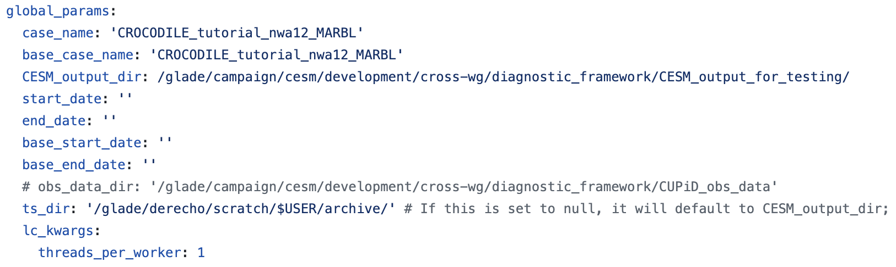
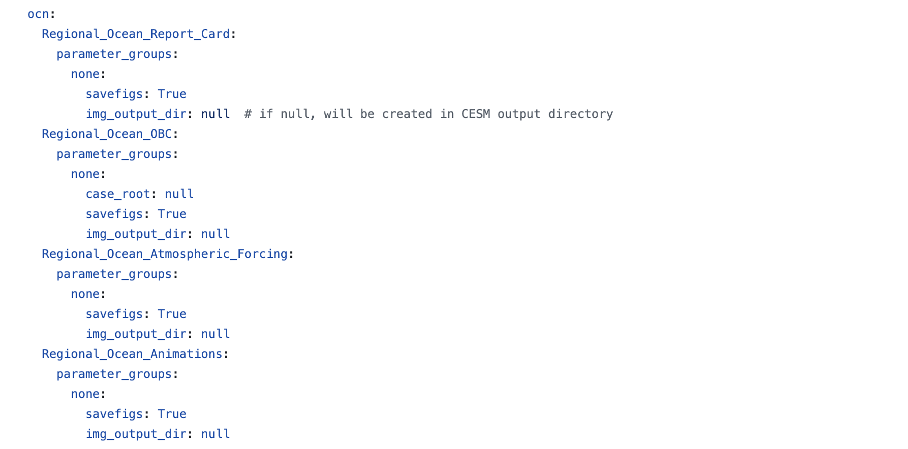

# Running a CUPiD Example

CUPiD provides examples of configuration files to allow users to look at a variety of diagnostics in `CUPiD/examples`.
These examples are designed to be run on the NCAR supercomputers,
using output curated from CESM development runs and stored in `/glade/campaign/cesm/development/cross-wg/diagnostic_framework/CESM_output_for_testing/`.
The provided configuration files also act as templates for the CESM workflow, as discussed in the CUPiD project pages.

> **Note:** we actually access the example output through the CROCODILE workshop directory for simplicity: `/glade/campaign/cgd/oce/projects/CROCODILE/workshops/2025/Diagnostics/CESM_Output/`.
> It just links back to `CESM_output_for_testing`.

There is a `regional_ocean` example in CUPiD that provides diagnostics for a 10-month CESM run created with CrocoDash.
This run uses a 1/12° grid over the northwest Atlantic domain, and includes ocean biogeochemistry tracers from the Marine Biogeochemistry library (MARBL).
(The compset used was `1850_DATM%JRA_SLND_SICE_MOM6%MARBL-BIO_SROF_SGLC_SWAV_SESP`.)

For this exercise, we will run the `regional_ocean` example in CUPiD.
This includes four notebooks:
- `Regional_Ocean_Report_Card.ipynb`: basic plotting and analysis utilities, primarily focused on surface fields.
- `Regional_Ocean_Animations.ipynb`: create animations.
- `Regional_Ocean_Atmospheric_Forcing.ipynb`: look at atmospheric forcing at the surface.
- `Regional_Ocean_OBC.ipynb`: visualize surface fields and open boundary conditions.


## Task 2: Let's Run CUPiD

Navigate to the examples subdirectory of your installation of CUPiD and look at what's inside:

```bash
cd ${CUPID_ROOT}/examples
ls
```

<div class="alert alert-warning">
<details>

<summary>Output</summary><br>

```bash
additional_metrics  external_diag_packages  key_metrics  regional_ocean
```
</div>

We will be using the `regional_ocean` example for this demo and the workshop:

```bash
cd regional_ocean
```

### 2.1 Confirm the Conda Environments Installed Correctly

For a standalone CUPiD run (as opposed to running it from a CESM case),
run the `cupid-diagnostics` command from the same directory as a `config.yml` file.
CUPiD will create a `computed_notebooks` directory for output.
This command will only be recognized in the `(cupid-infrastructure)` environment,
so let's make sure the `(cupid-infrastructure)` and `(cupid-analysis)` conda environments are fully installed for everyone.

```bash
conda activate cupid-infrastructure
which cupid-diagnostics
```

If the environment installed correctly,
`which` will return a path to `cupid-diagnostics`.
If the environment did not install correctly,
`which` will return an error like `which: no cupid-diagnostics in [long list of directories]`.

<div class="alert" role="alert" style="background-color:rgb(255,126,185); color: #5C0029; border-color:rgb(255,126,185);">
<h4 style="margin-top: 0; padding-top: 0; display: inline-flex; color: #5C0029;"> <strong> Checkpoint #3 </strong> </h4>

At this point the following should all be true:

1. your terminal is in CUPiD's `examples/regional_ocean` directory,
1. the `(cupid-infrastructure)` conda environment is active, and
1. the `which cupid-diagnostics` command found the `cupid-diagnostics` script.
</div>

### 2.2: Peek at the `config.yml`

While waiting for [CUPiD to install](CUPiD_intro) we saw that each example has a specific `config.yml`,
and we looked at the one in the `regional_ocean` example.
Let's open this file in the JupyterHub window and look a little closer.
Most of the settings in `config.yml` stay the same or similar from the other examples, but there are a few key changes to note.

#### Global Params

Here is where we specify that CUPiD should run diagnostics on the example output discussed above.

<div class="alert alert-warning">
<details>

<summary>Want to generate timeseries?</summary><br>

Note that the timeseries output directory `ts_dir` is not instantiated.
You are able to create timeseries files, but you are not able to save them to the `CESM_output_dir` as you normally would because we only have read permissions there.

If you want to run the timeseries tool,
set `ts_dir: /glade/derecho/scratch/${USER}/archive`
(or another directory you have write access to) and then run

```bash
cupid-timeseries
```

</div>

#### Notebook Parameters

Here we pass in the specific variables for each notebook. Read more about specific variables in each notebook. The `mom6_input_dir` let's us access the input boundary conditions, the CESM workflow will handle this automatically.

This section also tells us this example will run four notebooks:
`Regional_Ocean_Animations.ipynb`,
`Regional_Ocean_Atmospheric_Forcing.ipynb`,
`Regional_Ocean_OBC.ipynb`, and
`Regional_Ocean_Report_Card.ipynb`.

### 2.3 Time to Run CUPiD!
Now that we understand the processes and notebooks will run, it is time to run CUPiD.
From the same `${CUPID_ROOT}/examples/regional_ocean` directory, run on one processor with:

```bash
cupid-diagnostics --serial
```

This step might take some time, and we can track the progress with the output to terminal.

The notebooks will be run in `nblibrary` and then copied to `computed_notebooks/ocn` under the example directory.
If you want to rerun the notebooks, make sure to manually copy the `regional_utils.py` file with

```bash
cp ../../nblibrary/ocn/regional_utils.py computed_notebooks/ocn/
```

<div class="alert alert-warning">
<details>

<summary>Want to generate a webpage?</summary><br>
We recommend viewing the completed notebooks in JupyterHub.
This is the easiest way to see CUPiD output on the NCAR super computer,
and also makes it easy to re-run the notebooks manually if you want to play with the output.

If you want to use CUPiD's webpage feature, however, run

```bash
cupid-webpage
```

after `cupid-diagnostics` completes.
Like `cupid-diagnostics`, this command is part of the `(cupid-infrastructure)` environment and should be run from the directory containing `config.yml`.

Unfortunately, it is not easy to view webpages on the NCAR super computer.
Your best bet is probably copying the entire `computed_notebooks/_build/html` directory to your local computer.
More options are discussed in the CUPiD documentation for [Looking at Output](https://ncar.github.io/CUPiD/ncar_tips.html#looking-at-output).
</div>