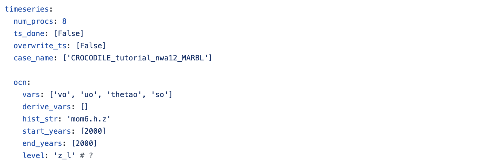

# Running a CUPiD Example

CUPiD provides examples of configuration files to allow users to look at a variety of diagnostics in `CUPiD/examples`.
These examples are designed to be run on the NCAR supercomputers,
using output curated from CESM development runs and stored in `/glade/campaign/cesm/development/cross-wg/diagnostic_framework/CESM_output_for_testing/`. 
These example configuration files also act as templates for the CESM workflow discussed in the next section.

We have added a `regional_mom6` example to CUPiD that provides diagnostics for a 10-month run.
This run uses a 1/12° grid over the northwest Atlantic domain, and includes ocean biogeochemistry tracers from the Marine Biogeochemistry library (MARBL).
The compset used for this run was

```
1850_DATM%JRA_SLND_SICE_MOM6%MARBL-BIO_SROF_SGLC_SWAV_SESP
```

We will run the `regional_ocean` example included with CUPiD. This includes four notebooks:
- `Regional_Ocean_Report_Card.ipynb`: basic plotting and analysis utilities, primarily focused on surface fields
- `Regional_Ocean_Animations.ipynb`: create GIFs of various surface fields
- `Regional_Ocean_Atmospheric_Forcing.ipynb`: look at atmospheric forcing at the surface
- `Regional_Ocean_OBC.ipynb`: visualize surface fields and open boundary conditions to look for weird behavior

#### What We Need
- The latest installation of CUPiD
- `cupid-infrastructure` and `cupid-analysis` conda environments installed
- Sufficient resources to run the example (run within JupyterHub or start a [PBS job](https://ncar-hpc-docs.readthedocs.io/en/latest/pbs/))
  - 🚧 This example needs about 100 GB of memory on a single core?

## Task 2: Let's Run CUPiD
Navigate to your installation of CUPiD, we will run the diagnostics in the example directory. 

```
cd CUPID_ROOT (see where you git cloned in Task 1 and set up env variable)
```

Now change to the `examples` directory, and look at what's inside.
```
cd examples
ls
```
We will be using `regional_ocean` example for this demo and the workshop; if this example is not in your `examples` directory, let us know. 
Change into the `regional_ocean` directory. 
```
cd regional_ocean
```
For a standalone CUPiD run (i.e. not part of a CESM case run) we will run `cupid-diagnostics` from the same directory as the `config.yml` file. 
CUPiD will automatically recognize the file is in the current directory, and the output will also be in the same directory. 

### Peak at the `config.yml`
Before running CUPiD and producing diagnostics, let's look at what the `config.yml` file is telling CUPiD to do. The last section also touched on this. 
There are multiple tools that you can use to view files in JupyterHub and Linux, we recommend using `cat` or `less` from the terminal, or opening it directly in JupyterLab. 
You can also view this config file [here](https://gist.github.com/AidanJanney/92e34fdae16bf993a57fac7112ab818c) (it may be outdated). 

Most of the settings in `config.yml` stay the same from the previous page, but there are a few key changes to note.

#### Global Params

Here is where we specify that CUPiD should run diagnostics on the example output discussed above. Also note the timeseries output directory is set to **null**. 
You are able to create timeseries files, but you are not able to save them to the `CESM_output_dir` as you normally would because we only have read permissions in `CESM_output_for_testing`. 

If you want to run the timeseries tool, set `ts_dir: /glade/derecho/scratch/$USER/archive` or another directory 
(replace `$USER` with your username, you can check what your username is with `echo $USER` in the terminal).

#### Timeseries Settings

The key here is to note which variables `cupid-timeseries` will generate timeseries for. The default here is to work with meridonal velocity (vo), zonal velocity (uo), potential temperature (thetao), and salinity (so).

***OPTIONAL**:* If you want to create timeseries, make sure to adjust `ts_dir` in the global parameters, and run 
```
cupid-timseries -ocn
```
The timeseries should be in `ts_dir/CROCODILE_tutorial_nwa12_MARBL/ocn/proc/tseries`. None of the diagnostics notebooks require timseries files.

#### Notebook Parameters

Here we pass in the specific variables for each notebook. If you don't want to save the figures from each notebook, change these variables to false. The `img_output_dir` is set to `null`, so it will save the images to your scratch directory in Derecho. If you would like them saved somewhere else, change this variable now. 

This section also tells us this example will run four notebooks: 
`Regional_Ocean_Animations.ipynb`,
`Regional_Ocean_Atmospheric_Forcing.ipynb`,
`Regional_Ocean_OBC.ipynb`, and
`Regional_Ocean_Report_Card.ipynb`.

### Time to Run CUPiD!
Now we understand the processes and notebooks will run, it is time to run CUPiD. From the same `CUPID_ROOT/examples/regional_ocean` directory, run on one processor with:
```
cupid-diagnostics --serial
```
This step might take some time, and we can track the progress with the output to terminal.

The notebooks will be run in `nblibrary` and then copied to the current directory under `computed_notebooks/ocn`. If you want to rerun the notebooks, make sure to manually copy the `regional_utils.py` file with
```
cp ../../nblibrary/ocn/regional_utils.py computed_notebooks/ocn/
```

### Optional: CUPiD Webpage
You can look at the notebooks in JupyterHub and rerun them. If you want to use CUPiD's webpage feature, in the current directory run:
```
cupid-webpage
```